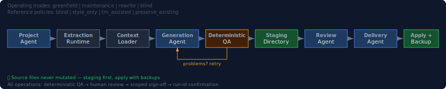
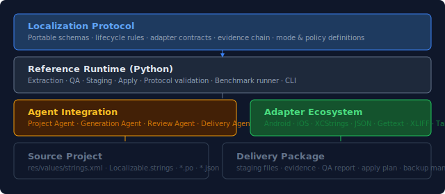
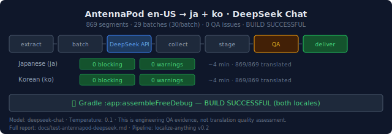

# Localize Anything

<p align="center">
  <strong>Agent-native localization infrastructure for real source projects.</strong><br>
  <em>LLMs can translate strings. Localize Anything makes localization deliverable.</em>
</p>

<p align="center">
  <a href="#localize-anything">English</a> ·
  <a href="README.zh-CN.md">简体中文</a>
</p>

<p align="center">
  
  
  
  
  
</p>

---

## Why Localize Anything?

Most localization tools focus on _editing translations_. Localize Anything focuses on
_delivering them safely_.

It is not a translation engine. It is the infrastructure layer that sits between
your source project, an LLM (or human translator), and the final deliverable —
enforcing protocol, preserving structure, catching regressions, and never silently
overwriting your source.

## What it does

- **Extract** translatable content from real project files
- **Plan** what to generate vs preserve based on operating mode
- **Generate** translations via LLM agents, with context and terminology
- **Stage** output in isolated directories — never touch your source
- **QA** every segment deterministically for placeholders, markup, format
- **Review** with human sign-off scoped to specific segments
- **Apply** only after explicit run-id confirmation, with backups

## How it works

<p align="center">
  
</p>

1. **Project Agent** reads your source and existing translations
2. **Extraction Runtime** produces stable, hash-keyed segments
3. **Context Loader** assembles terminology, TM, and reference material
4. **Generation Agent** produces target-language drafts
5. **Deterministic QA** validates placeholders, markup, and format compliance
6. **Staging** writes output to an isolated directory — your source is never touched
7. **Review Agent** imports human feedback, tracks sign-off per segment
8. **Delivery Agent** packages evidence, manifests, and apply plans
9. **Apply** writes files only after explicit run-id confirmation, with backups

## Core concepts

| Concept | What it means |
|---------|--------------|
| **Protocol-first** | Every artifact has a schema. Every lifecycle step produces evidence. |
| **Operating modes** | `greenfield_localization`, `existing_locale_maintenance`, `rewrite_or_harmonization`, `blind_benchmark` |
| **Reference policies** | `blind`, `style_only`, `tm_assisted`, `preserve_existing` |
| **Staged delivery** | Output is written to a staging directory. Nothing touches your project until apply. |
| **Deterministic QA** | Placeholder parity, markup integrity, format compliance — checked programmatically, not by LLM. |
| **Human review** | Segment-level sign-off. Reviewed translations are preserved in maintenance mode. |
| **Project memory** | Translation memory persists between runs. Reviewed segments survive source changes. |

<p align="center">
  
</p>

## Quick start

```bash
# Install
pip install -e ".[yaml]"

# Validate the protocol
python -m runtime.localize_anything validate-protocol
python -m runtime.localize_anything validate-contracts

# Run tests
python -m unittest discover -s tests -v

# Inspect a project
python -m runtime.localize_anything inspect /path/to/project

# Run a full localization pipeline (synthetic drafts, no real LLM)
python -m runtime.localize_anything localize-run \
  /path/to/project en-US ja \
  --source-files app/src/main/res/values/strings.xml \
  --operating-mode existing_locale_maintenance \
  --reference-policy preserve_existing \
  --run-id maintenance-001 \
  --synthetic-draft

# Run the v0.2.1 mode-system benchmark
python benchmarks/v021-mode-system/run.py
```

## Supported formats

| Area | Adapter | Status | Preserves |
|------|---------|--------|-----------|
| Android | `core.android-strings` | stable | strings, string-arrays, plurals, `translatable=false`, target-only keys |
| iOS | `core.ios-strings` | experimental | key-value pairs, comments |
| iOS String Catalog | `core.xcstrings` | experimental | structured JSON catalog |
| JSON locale | `core.json-locale` | stable | nested keys, nested markdown |
| YAML / TOML | `core.yaml-toml` | stable | inline and block values |
| CSV / TSV / XLSX | `core.tabular` | stable | column structure, row identity |
| Markdown / HTML | `core.markup` | stable | tags, attributes, code blocks |
| SRT / VTT | `core.subtitles` | stable | timing, markup |
| XLIFF 1.2 / 2.0 | `core.xliff` | stable | segments, notes, alt-trans |
| GNU gettext | `core.gettext-po` | stable | msgctxt, msgid_plural, fuzzy |

See [Adapter Contract](docs/adapters.md) for the full specification.

## Safety model

Localize Anything is designed to be _safe by default_.

| Safety property | How it's enforced |
|----------------|-------------------|
| **Staging first** | All output goes to a staging directory outside your project |
| **Dry-run apply plan** | Operations are previewed before execution |
| **Explicit confirmation** | Apply requires `--confirm-run-id` matching the delivery |
| **Backups** | Every replaced file is backed up before overwrite |
| **Source mutation check** | SHA-256 comparison before and after every run |
| **No silent overwrite** | Conflicts block apply until resolved |
| **Credential isolation** | API keys and tokens are never stored in memory or delivery |
| **Target-only preservation** | Existing translations without source keys are preserved, not deleted |
| **Blind benchmark isolation** | `reference_policy=blind` prevents existing translations from leaking into generation artifacts |

See [Security](docs/security.md) for the full safety architecture.

## Project memory

Localize Anything maintains project state across runs:

- **Translation memory** (`.localize-anything/translation-memory.jsonl`): approved and reviewed translations
- **Session index** (`.localize-anything/sessions/index.json`): run history
- **Config** (`.localize-anything/config.json`): operating mode, reference policy, source/target locale

In `existing_locale_maintenance` mode, reviewed translations with unchanged source hashes
are automatically preserved — no re-translation, no churn.

## Review and delivery workflow

```
Review Agent → scoped sign-off → Delivery Decision → Apply Plan → Apply with backups
```

- **Review Agent**: imports human feedback, tracks which segments are signed off
- **Delivery Decision**: assesses QA status, apply conflicts, and unprocessed assets
- **Apply Plan**: lists every file operation (create / replace / unchanged / conflict)
- **Apply**: executes only after owner confirms the run ID; creates backups for replacements

Slient overwrite is never allowed.

## Benchmarks and evidence

### v0.2.1 Mode System Benchmark

| Mode | Reference Policy | Result |
|------|-----------------|--------|
| `blind_benchmark` | `blind` | pass — no leakage to generation artifacts |
| `greenfield_localization` | `style_only` | pass |
| `existing_locale_maintenance` | `preserve_existing` | pass — 10 preserved, 2 generated |
| `rewrite_or_harmonization` | `tm_assisted` | pass |

**Verified behaviors:**
- Blind reference isolation: existing translations never leak into generation artifacts
- Maintenance preservation: reviewed unchanged segments are preserved, not mass-rewritten
- Obsolete key protection: target-only keys are detected, staged, and not silently deleted
- Source mutation check: fixture file hashes unchanged across all runs

**Fixture**: synthetic Android project (12 source segments, 10 existing zh-CN translations).
Runner: `benchmarks/v021-mode-system/run.py`.

### v0.2.3 Android resource reliability

Localize Anything v0.2.3 extends Android string-resource handling with
deterministic support for placeholders, escaped percent, inline markup
(`<b>`, `<i>`, `<u>`, `<a href>`), CDATA boundaries, XML comment round-trip,
string-array and plural resource types, source-set and resource-qualifier
routing, maintenance-mode preservation, and deterministic review-risk
classification metadata. It also preserves canonical Android qualifier order,
including MCC/MNC before the target locale, and guarantees that structural risk
evidence is emitted only for structure actually present in the segment.

See [Android Support in v0.2.3](docs/android-v0.2.3-support.md) for the
current support boundary, known limitations, and explicit non-goals.

### AntennaPod DeepSeek Translation Test

<p align="center">
  
</p>

| Metric | Japanese (ja) | Korean (ko) |
|--------|--------------|-------------|
| Source | AntennaPod `develop` branch | same |
| Segments | 869 | 869 |
| Batches | 29 | 29 |
| Model | `deepseek-chat` | `deepseek-chat` |
| QA | 0 blocking, 0 warnings | 0 blocking, 0 warnings |
| Build | `:app:assembleFreeDebug` ✓ | `:app:assembleFreeDebug` ✓ |

Full pipeline: extract → batch → DeepSeek API → collect → stage → QA → deliver.

> **Note**: This is engineering and automated QA evidence, not a claim of
> professional native-level localization quality. The AntennaPod test
> demonstrates pipeline correctness, not translation quality assessment.

## What it is not

Localize Anything is **not**:

- a prompt collection
- a generic machine translation wrapper
- an APK / IPA repackaging tool
- a replacement for qualified human review
- a tool that silently rewrites your source project
- a claim that LLM output is production-ready without evidence

## Repository layout

```
protocol/         Portable schemas and lifecycle specification
runtime/          Reference runtime (Python)
adapters/         Adapter manifests and entrypoints
benchmarks/       Public benchmark fixtures and runners
tests/            Runtime unit and integration tests
docs/             Public documentation
```

## License

MIT — see [LICENSE](LICENSE).
