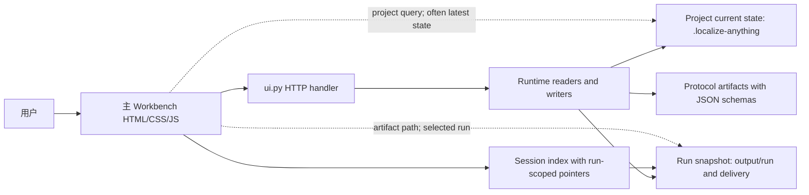

# Workbench UX & UI 开发指导方案

> 审计基线：2026-07-13，当前工作区 `ac15dfa` 及其未提交 Workbench 改动。
> 本文审计主 Workbench（`runtime/localize_anything/ui.py` 中的
> `WORKBENCH_HTML`）与本地 HTTP/runtime contract 的契合度。它不把架构
> seed 当成稳定发布能力，也不把 provider-free demo 当成翻译质量证据。

## 1. 执行结论

当前实现不是“前端与后端完全脱节”，而是两种成熟度同时存在：

- **窄范围的安全演示与只读审查路径契合度较高。** 项目选择、inspect、
  session、provider-free demo、artifact 预览、readiness/delivery/apply
  只读投影能够形成可运行闭环，并保持 Apply 与 provider 声明 fail-closed。
- **面向目标架构的完整 Workbench 契合度仍然偏低。** 后端已经拥有 review
  queue、readiness action、human review、claim acceptance、signoff、workflow
  resume/recovery、knowledge/document/provider evidence 等 contract；主界面基本
  没有消费这些行动型能力，用户能看到阻塞，却不能在同一任务流中安全地解决
  阻塞。

按 0–5 的证据型审计量表评估（5 表示目标 contract 已完整映射并有回归证据；
该分数只是 gap 排序工具，不是产品质量或发布就绪度声明）：

| 维度 | 当前评分 | 判断 |
| --- | ---: | --- |
| 架构与安全边界 | 4.5 | UI 不计算 readiness、不执行 Apply、不把缺失 provider 证据升级成质量声明。 |
| 当前 happy path 请求/响应 | 4.0 | 14 个主界面 API 路径的演示、inspect、session、预览路径可运行且有测试。 |
| run 身份与历史一致性 | 2.0 | session 是 run-scoped，多个 readiness API 却读取 project-level 当前 state；无效 run 会静默回退。 |
| missing / stale / error 语义 | 2.5 | artifact 状态总体 fail-closed，但 `getOptional()` 把网络、权限、解析和缺失全部折叠成 `null`。 |
| 用户行动闭环 | 1.5 | 后端 action/queue contract 丰富，主 Workbench 仍以只读展示为主。 |
| HTTP contract 可维护性 | 2.0 | artifact schema 很强；HTTP envelope、错误码、run 查询和主客户端类型约束较弱。 |
| 可访问性与响应式 | 3.0 | 320px 无页面横向溢出、已有 focus/reduced-motion/aria-live；仍缺 H1、skip link、`aria-current`，部分触控目标不足 44px。 |
| 国际化与状态文案 | 3.0 | 中英切换与结构化状态标签已存在；后端自由文本仍直接穿透，造成中英混杂和不可稳定本地化。 |

综合判断：**当前主 Workbench 适合作为安全的 provider-free 入口和审查
dashboard seed，不应被描述为已经覆盖目标架构的完整工作台。** 开发优先级应是
先修 contract identity 和错误语义，再接通现有 action queue；视觉重做排在其后。

## 2. 审计依据与边界

### 2.1 指导性文件中的目标约束

本文采用以下仓库事实作为 intent：

- `docs/architecture.md:13-20`：Model 负责语义，Runtime 负责确定性验证与边界，
  Artifact 负责证据，人负责高风险授权。
- `docs/architecture.md:169-171`：影响生成、交付、Apply 的决定不能只存在于 UI
  状态中，必须落到 durable artifact。
- `docs/architecture.md:185-215`：目标流程覆盖 intake、capability、locale、brief、
  preflight、generation handoff、QA、review、repair、signoff 与 optional Apply。
- `protocol/SPEC.md:1253-1290`：Workbench 应渲染 review/claim/signoff queue，
  不应在 UI 本地推断 readiness。
- `protocol/SPEC.md:1292-1319`：写操作必须委托 `workbench-action` runtime surface。
- `protocol/SPEC.md:1321-1357`：readiness gap 应通过 readiness action queue 与 action
  result/log 形成可审计闭环。
- `protocol/SPEC.md:1363-1384`：console 写操作必须走既有 action endpoints；
  forbidden claim 与 stale evidence 必须持续可见。
- `docs/architecture-roadmap.md:112-121`：P1 明确包含 Workbench UX simplification，
  同时要求 provider-safe、staged output 和显式 Apply confirmation。

### 2.2 当前实现事实

当前主 Workbench 具有以下结构：

- `ui.py` 共 4,736 行，包含 HTTP handler、路径/请求校验、API dispatch、HTML、CSS、
  i18n 字典和客户端状态管理。
- 服务端暴露 191 个唯一 `/api/*` 路径；主 `WORKBENCH_HTML` 客户端直接引用 14 个。
  这不意味着 UI 应覆盖全部 191 个端点；真正的问题是用户任务所需的 queue/action
  聚合能力尚未进入主路径。
- protocol 当前有 192 个 schema 与 192 个 example；artifact contract 比 HTTP/UI
  contract 更成熟。
- `WorkbenchUITests` 当前有 4 个测试方法，覆盖 safe demo、主路由、inspect/run/read、
  import 安全与本地目录选择，但没有覆盖无效 run、历史 run、review GET 失败、未知
  status、本地化自由文本或键盘/响应式行为。
- 实机验证通过：默认桌面布局清晰；320px 下无页面横向滚动；safe demo 能进入
  `/review?...&run=quickstart-demo`；当前相关测试与 protocol/adapter validation 均通过。

### 2.3 不在本轮结论中的内容

- 不评估 provider 真实翻译质量。
- 不把 191 个 API 的存在等同于稳定产品能力。
- 不要求主导航直接呈现 benchmark、release、adapter、provider 的每个底层 artifact。
- 不建议在 P0 引入 React、Vue、Tailwind、外部字体或新的后端框架。
- 不扩大 Apply、真实 provider execution 或远程协作的授权范围。

## 3. 当前前后端结构图



这个结构的关键问题不是“有没有数据”，而是同一审查页同时读取两个时间语义：

- session index 和 run artifact pointer 表示**选中的历史运行快照**；
- `?project=...` readiness/artifact endpoints 表示**项目当前状态**。

当用户选择的不是最新 run 时，这两个语义可能不一致。前端当前以 `run_id` 过滤不匹配
artifact，结果会安全地变成空值，但用户看见的是“缺失”，而不是“你正在查看历史快照，
当前项目状态属于另一个 run”。

## 4. 主 Workbench API 契合度矩阵

### 4.1 当前直接消费的 14 个 API

| API | 主界面用途 | 当前契合度 | 主要 gap |
| --- | --- | --- | --- |
| `GET /api/health` | 本地服务状态与版本 | 高 | 只证明 Workbench 服务在线，不证明 runtime/provider/项目能力；当前文案基本守住边界。 |
| `POST /api/inspect` | 项目扫描与 routing | 高 | HTTP 请求/响应无独立 schema；错误只有自由文本。 |
| `POST /api/sessions` | session index | 高 | 服务端不接受或验证目标 `run_id`；客户端负责查找并可能回退。 |
| `POST /api/quickstart-demo` | provider-free demo | 高 | 同步请求；没有 operation/progress contract，真实大项目模式不可照搬。 |
| `POST /api/import-files` | 复制文件到临时项目 | 中高 | 限额与路径安全存在；浏览器先把全部文件 base64 化，缺少进度、取消和失败项明细。 |
| `POST /api/pick-directory` | 本机目录选择 | 高 | loopback 检查明确；远程 host 模式的整体支持边界仍未成为显式 product contract。 |
| `POST /api/agent-run` | handoff、synthetic demo、response import | 中 | 请求字段很多、客户端只使用一部分；同步长任务、无 operation id、无服务端幂等键。 |
| `POST /api/read-artifact` | artifact inspector | 中高 | 路径 allowlist 与大小限制正确；返回 raw text，缺 MIME/schema/encoding 语义，JSON 解析失败被静默吞掉。 |
| `GET /api/artifact-state` | freshness/missing/review 统计 | 中 | 读取 project current state，不是明确的 selected-run snapshot。 |
| `GET /api/readiness-authorization-matrix` | review/delivery/apply 状态 | 中 | 同上；前端只在 `run_id` 相等时接受，历史 run 容易失去数据。 |
| `GET /api/delivery-readiness-report` | 交付状态 | 中 | project-level 与 run-level 混合；错误被当成缺失。 |
| `GET /api/apply-readiness-report` | Apply 阻塞与风险 | 中 | project-level 与 run-level 混合；阻塞计数与整体 review 卡片缺少作用域标签。 |
| `GET /api/provider-smoke-closure-report` | provider smoke 限定证据 | 中高 | 只有 session pointer 同时存在才查询，fail-closed 正确；仍受 run/project identity 问题影响。 |
| `GET /api/provider-smoke-evidence-manifest` | smoke evidence manifest | 中高 | 同上。 |

### 4.2 后端已存在、但主 Workbench 最值得优先接入的能力

不要按 endpoint 数量逐个做页面。主界面只需优先接入以下 task-level contract：

| 后端 contract | 用户任务 | 推荐 UI 入口 |
| --- | --- | --- |
| `workbench-review-queue` | 我还要审什么？ | Review 页统一“待处理事项”队列。 |
| `workbench-claim-queue` | 哪些声明可接受、需降级或必须拒绝？ | Review 页“声明”分区。 |
| `workbench-signoff-summary` | 当前是否具备交付/Apply 授权？ | Review 页 sticky authorization summary。 |
| `workbench-readiness-action-queue` | 哪个 gap 由谁、通过什么动作解决？ | Review 页主 action queue。 |
| `POST /api/workbench-action` | 记录 review、claim、signoff、follow-up | 队列项的受控操作。 |
| `POST /api/workbench-readiness-action` | 解决 readiness gap 并刷新证据 | 队列项的受控操作。 |
| `workflow-readiness-summary` | 当前 workflow 下一步是什么？ | Overview 与 run header 的 next-action。 |
| `locale-capability/risk/readiness` | 目标 locale 有哪些工程风险？ | Prepare 页预检与 Review 页风险分区。 |
| `translation/provenance` | 这个 segment/claim 的证据从哪来？ | Artifact inspector 的 evidence drill-down。 |
| document/knowledge/provider review queues | 特定任务类型的专业审查 | 统一 queue 的筛选器，不新增顶级导航。 |

其余 benchmark、release、adapter evidence 等端点应继续作为 expert/debug surface，
除非用户场景证明它们需要成为普通用户的日常任务。

## 5. 关键 gap 与修复要求

### G1. Selected run 与 project current state 存在双重真相

**优先级：P0；风险：高。**

- 实现证据：`ui.py:4173-4202` 从 session 取得 `run_id`，却用
  `?project=...` 请求 readiness/artifact；随后以 `artifact.run_id === runId`
  过滤。
- 服务端证据：`ui.py:1377-1388` 与 `ui.py:1498-1502` 从 project 下的
  `.localize-anything` 读取当前 artifact，没有 `run_id` 参数。
- 用户影响：查看历史 session 时，run-specific summary/apply plan 可能存在，
  project-current readiness 却属于最新 run；UI 会显示一半有数据、一半缺失。

**修复方向：**

1. 定义一个 canonical `WorkbenchRunView`，请求必须同时携带 `project` 和
   `run_id`。
2. 服务端必须返回三种明确结果：exact snapshot、current projection、not found；
   不得让客户端猜测。
3. 历史 run 的 immutable artifact 从 session pointer/run directory 读取；仅明确标注
   “当前项目状态”的区域可以读取 project current state。
4. 当历史 snapshot 没有某项 artifact 时，返回 `missing_in_snapshot`；当 project
   current artifact 属于另一个 run 时，返回 `newer_project_state_available`，不能都叫
   `missing`。

**验收：** 用同一项目创建两个 run，分别打开两个 URL；每个 URL 的 summary、
readiness、delivery、apply、artifact state 均保持同一 `run_id`，历史页不得自动升级到
最新 run。

### G2. 无效 run 被静默回退到最新 run

**优先级：P0；风险：高。**

- 实现证据：`ui.py:4081-4098` 查不到 requested run 时继续选择 latest session，
  然后改写 URL。
- 文档冲突：`docs/workbench-ui-contract-audit.md:11` 声明 invalid project/run 应显式
  失败并清空 stale client state。
- 实机证据：访问 `run=missing-run` 后 URL 被改成 `run=quickstart-demo`，没有错误。

**修复方向：** requested run 存在时必须 exact-match；找不到则显示
`RUN_NOT_FOUND` 空态，提供“返回最新运行”和“查看全部会话”两个显式动作。只有 URL
没有 run 参数时才允许默认选择 latest。

### G3. Review GET 错误被折叠为缺失

**优先级：P0；风险：高。**

- 实现证据：`ui.py:3807-3814` 的 `getOptional()` 捕获 HTTP、JSON 和网络错误后统一
  返回 `null`。
- 用户影响：权限错误、损坏 JSON、服务端异常、离线和 artifact 真正缺失在 UI 中
  看起来相同；用户无法恢复，也无法判断证据链是否可信。

**修复方向：** 使用四态结果而不是 nullable：

```text
available(data) | missing(reason) | stale(data, reason) | error(code, message)
```

404/artifact absent 可映射 missing；409/run mismatch 映射 stale/conflict；400 是用户可修复
输入错误；500/invalid JSON 是 error。错误必须进入 `role="alert"`，同时保留每张卡片的
局部 retry。

### G4. Artifact schema 强，但 HTTP envelope 弱

**优先级：P0；风险：中高。**

当前 API 依赖手写字符串和自由结构 dict。`contracts.py` 主要验证 adapter manifest，
`schema_validation.py` 验证 durable artifact；主 Workbench request/response 没有统一、
可验证的 contract。

**最小修复：** 不引入框架或代码生成器。先为主 Workbench 聚合 view、error envelope、
action request/result 各增加一个 JSON schema/example，并在现有 `validate-protocol` 与
`unittest` 中验证。

推荐统一 envelope：

```json
{
  "status": "pass",
  "api_version": "workbench-v1",
  "project_root": "C:/project",
  "run_id": "run-001",
  "data": {},
  "warnings": []
}
```

推荐错误 envelope：

```json
{
  "status": "fail",
  "api_version": "workbench-v1",
  "error": {
    "code": "RUN_NOT_FOUND",
    "message": "The requested run does not exist.",
    "field": "run_id",
    "recoverable": true,
    "actions": ["OPEN_LATEST_RUN", "OPEN_SESSIONS"]
  }
}
```

兼容期可以保留顶层 `error_message` 或旧字符串 `error`，但主客户端应改用稳定 code，
不再解析英文句子。

### G5. 用户能看到阻塞，但不能完成审查闭环

**优先级：P0；风险：高。**

架构要求 queue/action 写入 durable artifacts；后端已经实现。主 UI 当前只展示
readiness、风险和 raw artifact，无法在任务上下文内记录 human review、claim decision、
signoff、follow-up 或 readiness action。

**修复方向：** 在 Review 页增加一个统一“下一步”队列，按 runtime 提供的 owner、
severity、allowed actions 渲染。提交后必须：

1. POST 既有 action endpoint；
2. 原样显示 runtime action result；
3. 刷新 run view/queue/readiness；
4. 只有底层 artifact 改变后，队列项才可变成 resolved；
5. forbidden claim、stale evidence 和 limited scope 不能被 UI 本地隐藏。

### G6. 状态显示依赖字符串启发式

**优先级：P1；风险：中。**

`ui.py:4497-4524` 通过手写翻译表和 `includes("block" | "review" | "ready")`
选择颜色。新 enum 会直接显示 raw snake_case；包含 `ready` 或 `complete` 的否定状态也有
误分类风险。

**修复方向：** contract 输出稳定 `status_code` 与 `status_family`：

```text
status_family = neutral | progress | success | warning | blocked | error
```

UI 本地化 `status_code`，颜色只依赖 `status_family`。未知 code 显示“未知状态”并在
开发环境记录 contract mismatch，不能自动当 success。

### G7. 同步长任务没有 operation contract

**优先级：P1；风险：中。**

safe demo 很快，但 `agent-run`、大型 import/inspect 可能持续较久。当前全局 busy 会禁用
所有按钮，没有 stage、取消、重试或幂等语义。

**修复方向：**

- P0 保持同步，但显示动作名与阶段，防止重复提交，并在失败时保留输入。
- 当真实样本证明耗时超过交互阈值后，再引入最小 operation contract；优先复用已有
  workflow stage/status/idempotency artifact，不先建通用任务系统。
- operation 至少包含 `operation_id`、`state`、`stage`、`started_at`、`updated_at`、
  `retryable`、`result_run_id` 和 `error`。

### G8. 后端自由文本直接穿透，造成中英混杂

**优先级：P1；风险：中。**

实机审查页中仍出现 `Blocking question remains unresolved.`、readiness limitation 和
Apply warning 等英文正文。UI 已能翻译 gap type，但直接显示 `recommended_action` 或
`summary`。

**修复方向：** artifact 保留原始人类可读文本，同时增加稳定 `message_code` 与
`message_params`。卡片使用本地化短文案；原始 artifact 文本放在 evidence inspector 中，
避免丢失证据。

### G9. 可访问性基础存在，但页面语义未闭环

**优先级：P1；风险：中。**

已实现：表单 label、键盘 focus 样式、`aria-live`、reduced motion、文字+颜色的 status、
320px 无页面横向溢出。

仍需修复：

- 每个 route 使用一个 H1；当前可见页面从 H2 开始。
- 增加“跳到主要内容”链接。
- active nav 增加 `aria-current="page"`。
- 语言按钮、context button 和次要按钮最小目标 44×44 CSS px；实测部分为 30–36px。
- 窄屏 nav 虽不造成页面横向溢出，但 `Settings` 可能在横向区域外，需明确滚动提示或
  收纳菜单。
- artifact/user text 使用 `dir="auto"`；RTL 内容不得继承错误方向。
- error 使用 `role="alert"`，进度使用 `aria-live="polite"`，不要共用一个语义。

### G10. 单文件边界抬高了 contract 变更成本

**优先级：P1；风险：中。**

`ui.py` 同时承载 191-route dispatch、runtime imports、HTML、CSS、i18n 和客户端逻辑。
这使一次 status 或 endpoint 变更需要跨同一大字符串手工同步，测试也主要退化为 HTML
包含字符串断言。

**修复方向：** 不做框架迁移。等 P0 contract 固定后，把静态资产机械拆成：

```text
runtime/localize_anything/web/
  index.html
  styles.css
  app.js
  i18n.js
```

继续使用 Python 标准库与 package resources。`ui.py` 只保留 server/handler 和小型
projection functions。拆分本身不得改变 API、视觉或安全行为。

### G11. 本地信任边界需要成为显式 contract

**优先级：P1；风险：中高（仅在非 loopback host 时）。**

默认 host 是 `127.0.0.1`，这是安全基础；但 CLI 允许修改 host，而 API 没有认证、CSRF
或 origin contract。目录选择仅自身检查 loopback，其他 project/artifact/action API
仍依赖服务运行边界。

**修复方向：**

- 稳定 Workbench 明确只支持 loopback。
- 非 loopback bind 默认拒绝启动，或要求显式 unsafe/remote opt-in；远程模式必须另行
  设计认证与 origin policy，不能由 UI 文案暗示已支持。
- Settings 页显示实际 bind address 与“仅本机 / 非本机”风险状态。

## 6. 目标 Workbench contract

### 6.1 Canonical resource model

前后端共同使用六个概念，避免把文件路径当成产品模型：

| 资源 | 身份 | 生命周期 | UI 用途 |
| --- | --- | --- | --- |
| Project | canonical project root | 可变 | 项目范围、当前状态、session list。 |
| Run | `project_root + run_id` | 运行完成后 snapshot 不变 | 审查、历史、交付、Apply 计划。 |
| ArtifactRef | `artifact_id + path + run_id + freshness` | current/stale/missing/superseded | 预览与 provenance。 |
| QueueItem | stable item id + run id | open/addressed/resolved/blocked | 下一步任务。 |
| ActionRequest/Result | action id + actor + target | append-only/audited | 人工决策与 runtime 委托。 |
| Operation | operation id | queued/running/succeeded/failed/cancelled | 仅用于已证明需要异步的长任务。 |

### 6.2 最小 run-scoped 聚合 view

建议新增或扩展一个单一聚合读取面，而不是让主客户端继续拼接 8 个不同时间语义的
请求。名称可按代码现状决定，但 contract 应等价于：

```text
GET /api/workbench-run?project=<root>&run_id=<exact-id>
```

返回内容：

```json
{
  "status": "pass",
  "api_version": "workbench-v1",
  "project_root": "C:/project",
  "run_id": "run-001",
  "snapshot_kind": "exact_run",
  "session": {},
  "summary": {},
  "readiness": {
    "review": {},
    "delivery": {},
    "apply": {}
  },
  "artifact_state": {},
  "queues": {
    "review": {},
    "claims": {},
    "readiness_actions": {}
  },
  "signoff": {},
  "artifacts": [],
  "limitations": [],
  "next_actions": []
}
```

该 view 只做 projection，不新增 readiness 逻辑。所有判断继续来自 runtime artifacts。
如果某项只能从 project-current state 获得，必须放进独立
`current_project_projection` 字段，并携带其 `run_id`，不能伪装成 selected run snapshot。

### 6.3 状态轴必须正交

避免一个 badge 同时表达五种含义。前端模型至少区分：

| 状态轴 | 枚举示例 | UI 表达 |
| --- | --- | --- |
| 请求 | idle/loading/success/error | skeleton、局部 retry、alert。 |
| 执行 | not_started/running/succeeded/failed/cancelled | progress 与 operation details。 |
| freshness | current/stale/missing/superseded | 独立证据标签。 |
| QA | not_checked/pass/pass_with_warnings/fail | 确定性检查结果。 |
| review | not_requested/review_required/in_review/accepted/rejected | 人工语义审查。 |
| readiness | blocked/ready_with_warnings/ready | 分别用于 review、delivery、apply。 |
| authorization | not_requested/required/granted/rejected/expired | 高风险动作授权。 |
| evidence class | synthetic/mock/provider_path_smoke/provider_real/human | 证据来源，不等于质量。 |

“QA 通过”“交付包可审查”“Apply 阻塞”可以同时成立；UI 不应尝试压缩成单一“成功/失败”。

### 6.4 Error contract 与恢复动作

推荐稳定错误码：

| Code | HTTP | UI 行为 |
| --- | ---: | --- |
| `PROJECT_REQUIRED` | 400 | 聚焦项目输入。 |
| `PROJECT_NOT_FOUND` | 404 | 保留输入，提供重新选择。 |
| `RUN_NOT_FOUND` | 404 | 不回退；提供 latest/sessions 显式动作。 |
| `RUN_STATE_MISMATCH` | 409 | 显示历史 snapshot 与 current state 差异。 |
| `ARTIFACT_MISSING` | 404 | 局部 missing state，不触发全页 error。 |
| `ARTIFACT_STALE` | 409 | 显示 stale reason 与 recompute action。 |
| `ARTIFACT_OUTSIDE_ALLOWED_ROOT` | 403 | 阻止预览，说明本地安全边界。 |
| `INVALID_ARTIFACT_JSON` | 422 | raw preview 可用，结构化卡片不可用。 |
| `ACTION_BLOCKED` | 409 | 原样显示 runtime blockers。 |
| `ACTION_REQUIRES_CONFIRMATION` | 409 | 打开 scope confirmation，不自动重试。 |
| `SERVER_ERROR` | 500 | 局部 retry + diagnostics；不得显示成“无数据”。 |

## 7. 目标信息架构

顶级导航保持五项，但将任务命名与实际行为对齐：

1. **概览 Overview**：项目、最近运行、当前下一步、阻塞摘要。
2. **准备 Prepare**：替代含混的“生成”；选择项目、locale、mode、scope，运行 inspect/
   preflight，准备 handoff 或导入外部结果。
3. **审查 Review**：run-scoped dashboard、统一 queue、claims、evidence、artifacts、signoff。
4. **会话 Sessions**：精确选择历史 run，显示 snapshot/current 差异，不自动回退。
5. **设置 Settings**：语言、本地服务、版本、bind 安全状态、数据位置与非声明。

Review 内部使用二级结构，不增加更多顶级页面：

```text
Summary | Actions | Content & QA | Claims | Evidence | Artifacts
```

- 默认打开 Summary，并把唯一主 CTA 指向 runtime `next_action`。
- Actions 聚合 review/readiness/document/knowledge/provider queue。
- Evidence 按需展开；普通用户不需要理解 192 个 schema 文件名。
- Artifacts 是 expert/debug surface，保留 raw evidence，但不作为第一层产品 IA。

## 8. 关键用户流程

### 8.1 首次进入与安全演示

1. 用户看到本地运行、非上传、非 provider、非 Apply 的边界。
2. 点击“运行安全演示”。
3. 按钮进入明确阶段：复制 fixture → inspect → stage synthetic → QA → package。
4. 成功后进入 exact `quickstart-demo` run。
5. Review 页先显示“你可以证明什么 / 仍不能证明什么 / 下一步是什么”。

验收：重复运行产生隔离目录；不调用 provider；不修改 fixture/target；Apply blocked；
失败时保留阶段与恢复动作。

### 8.2 打开项目与准备 handoff

1. 选择本地目录或导入文件。
2. inspect 返回 adapter、supported/unsupported、scope 与 coverage warning。
3. 用户确认 source locale、target locale、mode 和 source scope。
4. 主 CTA 文案由 contract 决定：`Prepare generation handoff`，不叫“生成翻译”。
5. 完成后显示 handoff artifact 与下一步：外部生成、导入响应或解决 preflight blocker。

验收：没有 project/target locale 时不能提交；unsupported assets 与 locale risk 不得被
零值掩盖；用户修改 project 后必须清除旧 run projection。

### 8.3 导入生成结果

1. 用户选择 response directory。
2. UI 显示来源、预期 batch、文件数量和“仅导入到 staging”的边界。
3. runtime 验证并返回 accepted/rejected/missing batch 明细。
4. UI 进入 selected run Review，不把导入成功等同于 QA/quality/readiness。

### 8.4 Review 与 blocker resolution

1. Summary 展示 QA、review、delivery、apply 四个独立状态。
2. Actions 以优先级和 owner 排序，不按 artifact 文件名排序。
3. 用户打开 queue item，查看 evidence、影响范围、allowed actions 与 forbidden claims。
4. 提交 action；UI 显示 runtime result。
5. 刷新聚合 view；只有 artifact 证据改变后 item 才 resolved。

验收：limited-scope review 不能显示成 global readiness；project owner signoff 不能伪装
E2/E3/E4；action blocked 后不得乐观更新。

### 8.5 Signoff 与 Apply 计划

1. Review 页固定显示 delivery 与 apply 是不同决定。
2. Signoff 表单明确 actor、scope、accepted claims、limitations、run id。
3. UI 只创建/读取 signoff artifact。
4. Apply 卡片只预览 dry-run plan；主 Workbench 不新增自动 Apply 按钮。
5. 真正 Apply 继续走独立、显式确认路径，并显示 exact run id。

### 8.6 历史运行

1. Sessions 列表显示 run id、locale、mode、status、updated time 与 evidence freshness。
2. 选择 run 后 URL 持久化 exact id。
3. 历史 snapshot 顶部显示“历史运行”；如项目已有更新，显示“有更新的项目状态”，
   不替换当前页。
4. 缺失 snapshot 显示 run-not-found；提供显式导航，绝不静默回退。

## 9. 页面级开发规范

### 9.1 Overview

必须包含：

- 一条清晰 north-star 文案：准备可审查、可追溯、可安全应用的本地化产物。
- 最近项目/运行，而不是虚构 KPI。
- `next_action` 卡片；没有项目时只保留 safe demo 与 open project 两个主动作。
- 本地服务状态作为辅助信息；不得占据主视觉或暗示 provider ready。

### 9.2 Prepare

表单顺序：Project → Source scope → Target locale → Mode → Safety preview → Action。

- Advanced fields 默认折叠，但任何自动默认值都必须在 Safety preview 中可见。
- target/source locale 使用稳定 BCP 47 value；显示文本可以本地化。
- unsupported/non-text assets 以“未处理范围”展示，不算作 0。
- 主 CTA 只有一个；Inspect 是前置或次要动作，synthetic demo 必须明显标记 demo。

### 9.3 Review

首屏回答四个问题：

1. 这个 run 做了什么？
2. 当前可证明什么？
3. 还有什么阻塞或限制？
4. 用户下一步可以安全做什么？

状态卡要带作用域，例如“Apply blockers 14”“Matrix warnings 5”，不要同时显示一个
无作用域“阻塞项 0”和另一个“风险 19”。

### 9.4 Sessions

- 每行整个区域可点击且键盘可达。
- run id 使用等宽字体；locale、mode、status 用普通 UI 字体。
- 支持按 status/mode/locale 筛选放在 P1；不要先做复杂表格。
- URL 是可分享的本机深链接，但文案需说明只在相同本机路径/状态下有效。

### 9.5 Settings

只放真实可配置或可验证信息：

- UI language；
- Workbench/runtime version；
- bind address 与 loopback safety；
- temporary import/demo data location；
- provider 与 Apply 的明确非声明。

不要出现尚未实现的云同步、账号、团队或 provider credential UI。

### 9.6 Artifact inspector

- 支持 JSON、JSONL、Markdown、text 的明确类型标签。
- JSON 解析失败时显示 raw text + structured preview error。
- 显示 artifact id、run id、freshness、hash（若 contract 提供）、path 和 truncation。
- 长路径可复制但不默认完整铺开；用户内容使用 `dir="auto"`。
- 不允许预览目录；当前禁用行为保留。

## 10. 视觉与组件系统

### 10.1 视觉方向

采用“专业、本地优先、证据导向”的浅色数据密集 Workbench：中性背景、蓝色主动作、
清晰边框、有限阴影、无装饰性渐变和无终端 cosplay。当前视觉方向基本正确，重点是统一
状态与层级，不是全面换皮。

建议 token：

| Token | 建议值 | 用途 |
| --- | --- | --- |
| `--bg` | `#F8FAFC` | 页面背景。 |
| `--surface` | `#FFFFFF` | 卡片/表单。 |
| `--text` | `#0F172A` | 主文本。 |
| `--muted` | `#475569` | 次要文本，保持可读对比。 |
| `--border` | `#E2E8F0` | 分隔与边界。 |
| `--accent` | `#2563EB` | 主 CTA、focus、active nav。 |
| `--success` | `#15803D` | 已证明通过。 |
| `--warning` | `#B45309` | 需要审查/有限。 |
| `--danger` | `#B91C1C` | blocked/fail。 |
| `--info` | `#0369A1` | 当前/说明。 |

状态不能只靠颜色；始终同时提供图标或文字。P0 不做 dark mode，待 token 和状态 contract
稳定后再作为 P2。

### 10.2 字体与排版

- 保持本地系统字体，避免为本地优先工具加载 Google Fonts：
  `system-ui, "Segoe UI", "Noto Sans SC", sans-serif`。
- run id、hash、artifact id 使用等宽 fallback；正文与标题不要全等宽。
- 每页一个 H1；卡片标题 H2；卡片内部组 H3。
- 正文最小 14px，主要表单 16px；行高 1.45–1.6。
- 中英文切换后，不依赖固定宽度或硬编码单行。

### 10.3 组件清单

P0 只维护以下核心组件：

- AppHeader / RouteNav
- ProjectContextBar
- PageHeader
- StatusChip
- EvidenceStateBadge
- SummaryCard
- QueueList / QueueItem
- ActionPanel / ConfirmationScope
- EmptyState / ErrorState / StaleState
- ArtifactLink / ArtifactInspector
- Field / LocaleSelect / ModeChoice
- LocalNotice / SafetyBoundary

组件不是新框架；先用语义 HTML、CSS class 与小型原生 JS render function 实现。

### 10.4 响应式

验收宽度：320、768、1024、1440px。

- 320：单列；nav 可收纳或有明确横向滚动 affordance；所有主动作全宽或自然换行。
- 768：单列/双列切换；queue 保持列表，不压缩成不可读表格。
- 1024：review summary 2–3 列；action queue 与 inspector 可主从布局。
- 1440：限制内容最大宽度；不无限拉长行宽。
- 任何宽度不得发生页面级横向滚动；宽表放在自身可滚动容器。

### 10.5 可访问性 Definition of Done

- WCAG 2.2 AA 作为目标。
- 全功能键盘可达，tab 顺序与视觉顺序一致。
- focus-visible 始终可见；没有键盘陷阱。
- 触控目标至少 44×44px。
- 每页 H1、skip link、active nav `aria-current`。
- 输入有 label；错误与字段建立 `aria-describedby`。
- error `role="alert"`，progress `aria-live="polite"`。
- `prefers-reduced-motion` 保持生效。
- 色彩不是唯一状态指示。
- artifact/translation text `dir="auto"`，测试 Arabic/Hebrew 混排。

## 11. 分阶段开发路线

每一阶段应是可独立审查的小 PR；不要把 contract、视觉重构和新功能混在一个大 PR。

### Phase 0：冻结现状与回归证据

目标：在改 contract 前记录当前行为。

- 为 14 个主客户端 API 建 request/response inventory。
- 增加两个 run 的 fixture/session 测试。
- 增加无效 project/run、artifact JSON 损坏、readiness endpoint 500/404 测试。
- 记录 320/768/1024/1440 手工截图基线。

退出条件：现有 safe demo、provider-free 与 Apply-blocked 边界都有自动断言。

### Phase 1（P0）：修复 identity 与 error contract

目标：同一页面只显示同一 run 的证据。

- 实现 exact run-scoped aggregate view，或等价地让所有相关 endpoint 接受并验证
  `run_id`。
- 无效 run 返回 `RUN_NOT_FOUND`；禁止静默 fallback。
- 替换 `getOptional()` 的 nullable 语义。
- 增加 versioned envelope schema/example 与 contract tests。

退出条件：双 run、missing、stale、corrupt、offline/500 行为可区分且可恢复。

### Phase 2（P0）：接通 task-first action queue

目标：用户从“看见问题”走到“通过 runtime 解决问题”。

- 接入 review、claim、signoff、readiness action queue。
- 使用既有 `workbench-action` 与 `workbench-readiness-action`。
- action result 原样呈现并刷新 aggregate view。
- 对 destructive/high-risk authorization 显示 scope confirmation；仍不执行 Apply。

退出条件：至少一条 human review、claim decision、follow-up 和 signoff 的完整写入/刷新
路径有测试；blocked action 不乐观更新。

### Phase 3（P1）：统一状态、文案与可访问性

目标：相同 contract 在所有页面表达一致。

- 建 status code/family registry，移除字符串颜色启发式。
- message code/params 支持中英本地化；raw evidence 可展开查看。
- 修复 H1、skip link、aria-current、44px targets、局部 alert/retry、RTL `dir=auto`。
- 把 Generate 顶级命名改为 Prepare，保持真实动作边界。

退出条件：未知 status fail-neutral；中英文无关键混杂；键盘完成核心流程。

### Phase 4（P1）：拆分静态资产与测试边界

目标：降低继续开发 queue/action 的改动风险。

- 机械拆分 HTML/CSS/JS/i18n，不改 API 或视觉。
- 提取纯 projection/render helper；server handler 继续用标准库。
- 测试从大段字符串包含断言转向 contract fixture + 关键 DOM 语义断言。

退出条件：拆分前后 safe demo 输出、路由、API 和截图无意外差异；无新依赖。

### Phase 5（P1/P2）：有证据后再做长任务 operation

目标：仅在真实项目证明同步模型不足时增加异步能力。

- 复用 workflow status/checkpoint/idempotency artifact。
- 增加 operation progress、retry 和结果 run pointer。
- 先不支持通用 cancellation；只有 runtime 能安全中断时才开放。

退出条件：重复提交不会重复产生冲突写入；刷新页面后可恢复 operation 状态。

### Phase 6（P2）：高级专业工作区

仅在前述 contract 稳定后考虑：

- segment-level bilingual review；
- provenance graph；
- document/knowledge/provider 专业筛选；
- visual/layout QA；
- dark mode；
- 团队/远程协作。

每项仍需独立 scope、schema、权限和证据，不因 roadmap 存在而成为产品声明。

## 12. 推荐的 PR 切片

| PR | 范围 | 明确不做 |
| --- | --- | --- |
| UX-01 | 双 run contract tests + invalid run 失败 | 不改视觉。 |
| UX-02 | run-scoped aggregate view + schema/example | 不接 action，不迁移框架。 |
| UX-03 | frontend typed result + 局部 error/missing/stale | 不做全站 redesign。 |
| UX-04 | unified review/readiness action queue | 不执行 Apply，不新增 provider call。 |
| UX-05 | status registry + i18n message code | 不改 runtime readiness 规则。 |
| UX-06 | H1/skip/aria-current/44px/RTL | 不加动画或 dark mode。 |
| UX-07 | 静态资产机械拆分 | 不改 contract/行为。 |
| UX-08 | operation progress（若真实耗时证据支持） | 不建立通用分布式任务系统。 |

## 13. 测试与验收矩阵

### 13.1 Contract tests

- 每个主 Workbench request/response example 通过 schema。
- 未知字段按 compatibility policy 处理；缺 required field 明确失败。
- 所有 run-scoped payload 的 `run_id` 一致。
- error code、HTTP status、recoverable/actions 一致。
- unknown status 不映射为 success。

### 13.2 Integration tests

- safe demo：provider/model 未调用、fixture/target 未修改、delivery warnings、Apply blocked。
- two runs：exact selection、no fallback、snapshot/current distinction。
- corrupt/missing/stale artifact：四态正确。
- action：accepted/blocked/failed 都写 log，刷新后的 queue/readiness 来自 runtime。
- path safety：outside root 失败；import traversal 失败；non-loopback picker 失败。
- localization：中英文 status 与 message code；未知 code fallback。

### 13.3 Browser acceptance

在 320/768/1024/1440 验证：

- 无页面级横向滚动；
- nav、主 CTA、queue action、inspector 键盘可达；
- 每页 H1 与 `aria-current`；
- loading、empty、missing、stale、blocked、error、success 各有独立状态；
- 语言切换不丢 run/project URL；
- 浏览器 back/forward 恢复 exact route/run；
- Arabic/Hebrew artifact 文本方向正确；
- reduced-motion 生效。

### 13.4 仓库验证命令

```powershell
python -B -m unittest tests.test_runtime.WorkbenchUITests -v
python -B -m unittest discover -s tests -v
python -B -m runtime.localize_anything validate-contracts adapters
python -B -m runtime.localize_anything validate-protocol protocol
python -B -m compileall -q runtime benchmarks
git diff --check
```

涉及 runtime seed promotion 时，继续执行仓库 release checklist 指定的 benchmark 与
release/public-claim audit；UI 通过不等于能力已可提升为 stable。

## 14. 产品与 UX 指标

本地优先意味着默认不上传 telemetry。若未来增加可选、本地聚合指标，优先记录：

- 首次项目打开成功率；
- inspect → handoff 完成率；
- review queue 到 resolved 的任务完成率；
- `RUN_NOT_FOUND`、artifact missing/stale/error 的分布；
- 用户因何被阻塞，而不是只记“点击次数”；
- Apply plan 被查看与真正显式授权之间的漏斗；
- screen reader/keyboard 核心流程通过率（测试指标，不收集用户隐私）。

禁止把 synthetic demo 完成率、provider path smoke 或结构 QA pass 解释成翻译质量指标。

## 15. 开发决策清单

每个 UX/UI PR 在开始前回答：

- 这是用户任务，还是把底层 artifact 文件名搬到屏幕上？
- 能否复用现有 queue/action/projection，而不是新增一套状态？
- selected run、project current state 和 artifact freshness 是否被明确区分？
- UI 是否在本地推断 readiness、质量或授权？如果是，停止并把逻辑移回 runtime。
- missing、stale、blocked、error 是否被分别处理？
- action 是否写入 durable artifact/log，并在 runtime 刷新后再更新 UI？
- 是否保持 provider-free 默认、staging、显式 Apply confirmation？
- 是否真的需要新依赖或框架？当前答案默认是“不需要”。
- 是否有最小 runnable regression check？

## 16. 明确不做

- 不做“一键完美翻译”或“一键 Apply”。
- 不让 UI 自己删除 forbidden claim、解决 queue item 或授权 readiness。
- 不把 project owner signoff 当作专业语言 review 等级。
- 不把 191 个 API 逐个变成菜单、tab 或卡片。
- 不因视觉完成而宣称 provider、locale、format 或 production ready。
- 不在 P0 引入 SPA 框架、CSS 框架、外部字体或云服务。
- 不静默回退 run、静默吞掉错误或用 `0` 代替 unavailable。
- 不把历史 run 的 snapshot 与项目最新 state 混在同一无标签视图中。

## 17. 最终 Definition of Done

当以下条件同时满足时，主 Workbench 才可被描述为与当前 artifact/runtime contract
形成完整产品闭环：

- exact run identity 从 URL、API、artifact 到 UI 全链一致；
- error/missing/stale/blocked 不再被折叠；
- review/readiness queue 可在主 UI 中通过既有 runtime action 安全处理；
- action result、log、刷新后的 readiness 都可审计；
- delivery 与 apply 独立，Apply 仍需要显式外部确认；
- 中英状态与结构化 message 无关键混杂；
- 核心路径满足键盘、H1、skip、aria-current、44px、RTL 与响应式要求；
- HTTP 主路径有 schema/example 与双 run 回归测试；
- UI 没有扩大 provider、quality、locale、format 或 release claim。

在此之前，推荐对外定位保持：**artifact-backed、provider-safe、review-oriented 的本地
Workbench seed**。

## 18. 本轮 UI 重做 Brainstorm 与决策

本轮先按产品经理、前端工程师、UI 设计师三个视角独立发散，再按用户价值、前后端
契约风险、实现成本排序。目标不是把全部 runtime 能力都放进导航，而是让用户在任意
时刻知道当前项目、selected run、证据状态和唯一的下一步。

### 18.1 产品经理视角

| 想法 | 用户价值 | 本轮决策 |
|---|---|---|
| 首页只推荐一个 next useful action | 降低首次使用和中断恢复成本 | 已采用；根据是否存在 run 引导 Prepare 或 Review |
| Safe demo 先说明边界再运行 | 用户在执行前知道不会调用 provider、不会改源文件 | 已采用；三项安全边界固定显示 |
| Review 必须以 exact `run_id` 为产品对象 | 历史审计不被 latest run 静默替换 | 已采用；URL、API、页面标题同一身份 |
| 把 Review queue 作为主要待办，而非展示全部 artifact | 聚焦需要人处理的事项 | 已采用；只显示当前作用域的 actionable items |
| Apply 与 delivery 拆成两个决策 | 避免“可交付”等同“可写回” | 已采用；仅预览 Apply plan，并保留独立授权文案 |

### 18.2 前端工程师视角

| 想法 | 工程价值 | 本轮决策 |
|---|---|---|
| `/api/workbench-run` 作为 Review 唯一聚合入口 | 防止多请求拼接出跨 run 混合状态 | 已采用 |
| `available / missing / stale / error` 使用 typed result | 不再用 null 或绿色状态吞掉失败 | 已采用；卡片就地展示并保留 raw artifact 入口 |
| 状态颜色由 status family registry 统一映射 | 新状态默认中性，不被误判为 success | 已采用 |
| action payload 同时携带页面和 action 的 `run_id` | 在写入前阻断身份错配 | 已采用；后端返回 `RUN_STATE_MISMATCH` |
| 保持原生 HTML/CSS/JS 和 Python 本地服务 | 避免新构建链、依赖和迁移风险 | 已采用；UI 常量独立成单文件，旧实现删除 |

### 18.3 UI 设计师视角

| 想法 | 体验价值 | 本轮决策 |
|---|---|---|
| 五个任务页加一条稳定 context strip | 用户始终看到项目和 run，不被长页面淹没 | 已采用 |
| 蓝灰中性色、单一主 CTA、低层级阴影 | 建立层级而不制造视觉噪声 | 已采用 |
| 高级参数折叠，必填项保持首屏可见 | 新用户简单，专家仍可控制 | 已采用 |
| Artifact 使用侧边 inspector 按需查看 | 证据可追溯但不占据主任务区 | 已采用 |
| 响应式网格、44px 目标、skip link、reduced motion | 桌面与窄屏均可用，键盘路径完整 | 已采用并由静态回归覆盖 |

### 18.4 综合 Top 5

1. exact `run_id` Review 聚合，禁止 latest fallback；
2. typed missing/stale/error/blocked 状态与局部恢复；
3. Overview 只给一个 next useful action；
4. Review queue、readiness、Apply plan 与 artifact inspector 同页但分层展示；
5. provider-free、源文件不变、Apply 单独授权的边界始终可见。

排序依据是：先避免错误决策和数据损失，再降低任务认知成本，最后优化视觉密度。
这些决策已经反映在当前实现和 `WorkbenchUITests` 回归契约中。
